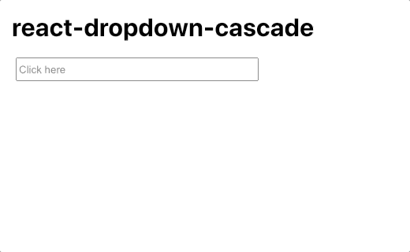

# react-dropdown-cascade

A [React](https://reactjs.org) component inpired by [rc-cascader](https://www.npmjs.com/package/rc-cascader), without external dependencies and styled like [material design](https://material.io/design).

Installation
============

```sh
npm install react-dropdown-cascade --save
```

or

```sh
yarn add react-dropdown-cascade
```

Usage
=======

```jsx
import React from 'react';
import DropdownCascade from 'react-dropdown-cascade';

const items = [
  {
    value: '1',
    label: 'Menu 1',
    children: [
      {
        value: '11',
        label: 'Another Item'
      },
      {
        value: '12',
        label: 'More Items',
        children: [
          {
            value: '121',
            label: 'Sub Item A'
          },
          {
            value: '122',
            label: 'Sub Item B',
            disabled: true
          },
          {
            value: '123',
            label: 'Sub Item C'
          }
        ]
      }
    ]
  },
  {
    value: '2',
    label: 'Menu 2'
  },
  {
    value: '3',
    label: 'Menu 3',
    children: [
      {
        value: '31',
        label: 'Hello'
      },
      {
        value: '21',
        label: 'World'
      }
    ]
  }
];

export default function App() {
  return (
    <>
      <h1 style={{ margin: 15 }}>react-dropdown-cascade</h1>
      <DropdownCascade
        dropdownStyle={{ margin: '5px 20px 15px 20px' }}
        items={items}
        onSelect={(value, selectedItems) => console.log(value, selectedItems)}
      >
        <input placeholder="Click here" style={{ height: 24, width: 300 }} />
      </DropdownCascade>
    </>
  );
}
```

Screenshots
===========



API
===

Props

| Prop                      | Type          | Required | Default                                                  | Description                                                              |
|---------------------------|---------------|----------|----------------------------------------------------------|--------------------------------------------------------------------------|
| defaultValue              | string        | no       | undefined                                                | Initial value                                                            |
| disabled                  | boolean       | no       | false                                                    | Pass disabled to children prop component                                 |
| dropdownClassName         | string        | no       | undefined                                                | The additional className of dropdown                                     |
| dropdownStyle             | CSSProperties | no       | undefined                                                | The additional style of dropdown                                         |
| dropdownMenuClassName     | string        | no       | undefined                                                | The additional className of dropdown menu                                |
| dropdownMenuStyle         | CSSProperties | no       | undefined                                                | The additional style of dropdown menu                                    |
| dropdownMenuItemClassName | string        | no       | undefined                                                | The additional className of dropdown menu item                           |
| dropdownMenuItemStyle     | CSSProperties | no       | undefined                                                | The additional style of dropdown menu item                               |
| dropdownSubItemClassName  | string        | no       | undefined                                                | The additional className of dropdown subitem                             |
| dropdownSubItemStyle      | CSSProperties | no       | undefined                                                | The additional style of dropdown subitem                                 |
| expandTrigger             | string        | no       | 'click'                                                  | Trigger that shows the dropdown                                          |
| fieldNames                | object        | no       | { value: 'value', label: 'label', children: 'children' } | Custom field name for label and value and children                       |
| items                     | array         | **yes**  |                                                          | The data for cascade                                                     |
| onSelect                  | function      | no       | undefined                                                | Callback with selected value and as 2nd param the items without children |
| separatorIcon             | string        | no       | ' > '                                                    | Customize the separator when join path labels until selection            |

License
=======

[MIT](https://choosealicense.com/licenses/mit)
